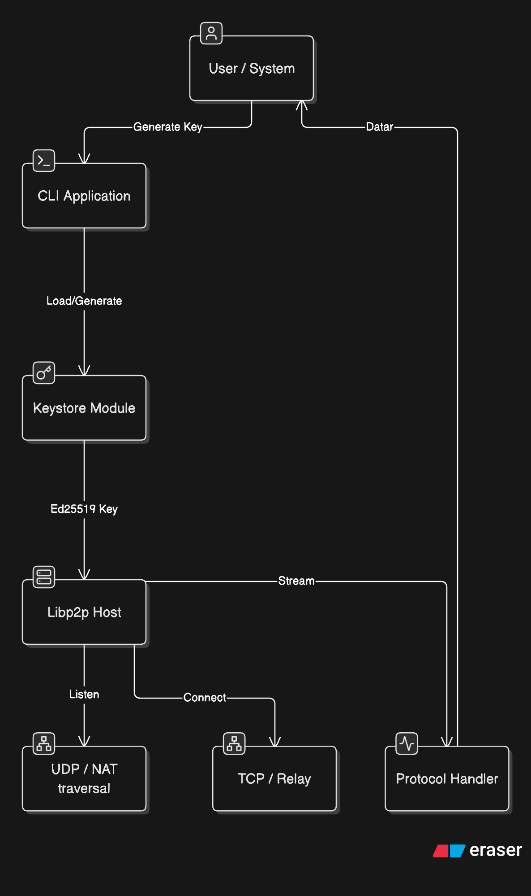
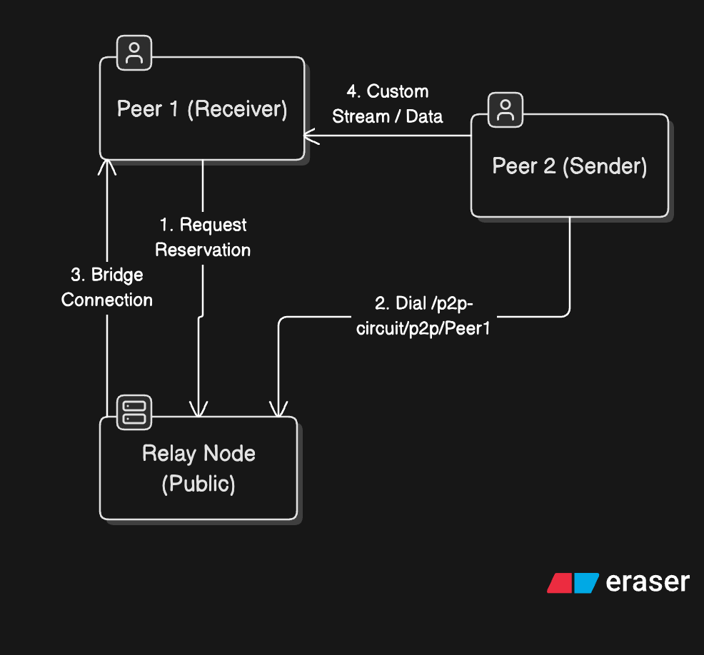
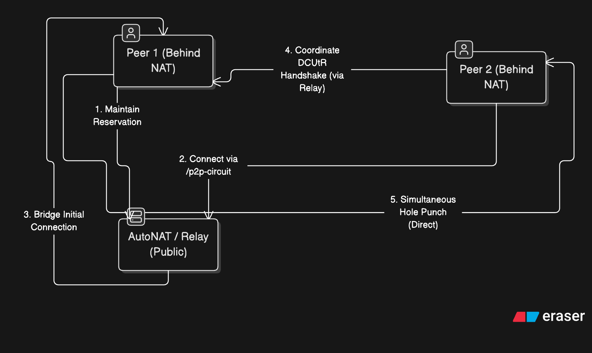

## Phase 1 Architecture: Identity & Local Loopback

Loading identity key: peer2 spun up and successfully found its Ed25519 cryptographic identity key that was saved to disk (so its Peer ID remains stable).
Starting libp2p host: It bound to port 9001 and printed its own unique identity: 12D3KooWJRn4VEFjNMxYR8eGVf9PWwHrEucFFJ3S3c6TuhhGBhfV.
Dialing target: Because you updated the docker-compose.yml file with Peer 1's ID (12D3KooWLxCmz...), Peer 2 actively reached out over the local Docker network (/dns4/peer1/tcp/9000) to find Peer 1.
Connected to peer: The two nodes successfully performed a handshake! The libp2p transport layer negotiated the connection securely using their respective Ed25519 keys.
Received reply: Peer 2 opened a stream using our custom protocol (/cipher/filetransfer/1.0.0), sent a "Hello", and Peer 1 sent back the message: "Hello from 12D3KooWLxCmz..."

## Phase 2 Architecture: Relay Bootstrap

In Phase 2, a central Relay node bridges the connection between peers that cannot reach each other directly (e.g. behind strict NATs). Peer 1 requests a reservation on the Relay, and Peer 2 dials the Relay to request a circuit to Peer 1.

## Phase 3 Architecture: DCUtR (Hole Punching)

In Phase 3, peers utilize the Relay to coordinate a direct TCP/UDP hole punch (Direct Connection Upgrade through Relay). Once the direct connection is established, the Relay is dropped.

