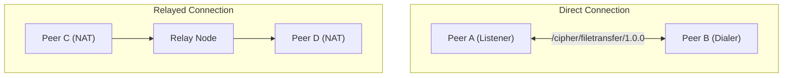

# CIPHER P2P Architecture

## Overview
The CIPHER project is built on top of [libp2p](https://libp2p.io/), utilizing a modular approach to separate concerns across the transport, identity, cryptography, and protocol layers.

## Modules

### `cmd/` (Entrypoints)
- **peer**: The standard client node participating in the network.
- **relay**: A specialized node designed to relay traffic between peers that may be behind NATs or firewalls.

### `internal/` (Core Logic)
- **transport**: Manages the initialization of libp2p hosts, connection establishment, and multiplexing.
- **identity**: Handles peer ID generation, key management, and cryptographic identities. It includes a persistent identity system that ensures a node's `PeerID` remains constant across restarts by storing an Ed25519 private key in the user's OS-level configuration directory (`~/.config/cipher/`, `Library/Application Support/CIPHER/`, or `AppData/Roaming/CIPHER/`).
- **crypto**: Provides standard cryptographic primitives for the broader application.
- **protocol**: Defines the custom network protocols used by CIPHER, currently including `/cipher/filetransfer/1.0.0` for direct P2P communication.
- **chunk** & **packet**: Handles the chunking and packetization of data for efficient transmission.
- **merkle**: Implements Merkle trees for data verification and integrity checks.

## Network Topology
The network utilizes a hybrid peer-to-peer topology where standard peers connect to one another directly if possible, or fallback to utilizing `relay` nodes for NAT traversal and connectivity routing.

