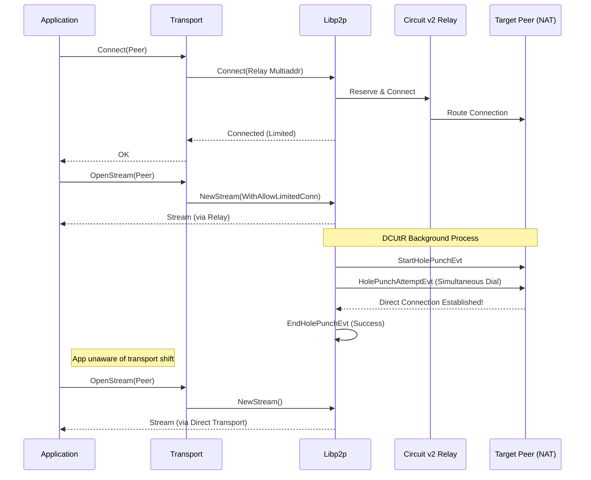
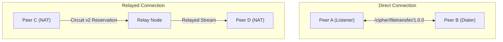

# CIPHER P2P Architecture

## Overview
The CIPHER project is built on top of [libp2p](https://libp2p.io/), utilizing a modular approach to separate concerns across the transport, identity, cryptography, and protocol layers.

## Modules

### `cmd/` (Entrypoints)
- **peer**: The standard client node participating in the network.
- **relay**: A specialized node designed to relay traffic between peers that may be behind NATs or firewalls.

### `internal/` (Core Logic)
- **transport**: Manages the initialization of libp2p hosts, connection establishment, and multiplexing.
- **identity**: Handles peer ID generation, key management, and cryptographic identities. It includes a persistent identity system that ensures a node's `PeerID` remains constant across restarts by storing an Ed25519 private key in the user's OS-level configuration directory (`~/.config/cipher/`, `Library/Application Support/CIPHER/`, or `AppData/Roaming/CIPHER/`).
- **crypto**: Provides standard cryptographic primitives for the broader application.
- **transfer**: Defines the binary, length-prefixed file transfer protocol with end-to-end SHA-256 integrity verification, keeping the application decoupled from the transport.
- **protocol**: Defines the custom network protocol IDs used by CIPHER, currently including `/cipher/filetransfer/1.0.0` for direct P2P communication.
- **chunk** & **packet**: Handles the chunking and packetization of data for efficient transmission.
- **merkle**: Implements Merkle trees for data verification and integrity checks.

## Network Topology
The network utilizes a hybrid peer-to-peer topology where standard peers connect to one another directly if possible, or fallback to utilizing `relay` nodes for NAT traversal and connectivity routing.

### Transport Abstraction
To ensure that the application logic remains decoupled from the underlying transport state, CIPHER implements a `Transport` abstraction layer (`internal/transport/stream.go`). The application simply calls `Transport.Connect()` and `Transport.OpenStream()`. The Transport layer delegates the connection selection to libp2p, which autonomously manages background transport upgrades (e.g., Hole Punching) and provides the application with the best available path.

### Relay Connectivity & DCUtR Hole Punching (Circuit v2)
CIPHER leverages go-libp2p's `circuitv2` protocol for initial relaying and NAT traversal coordination. By default, `circuitv2` establishes **limited** (transient) connections.

While the application can fall back to communicating over these limited relay connections using `network.WithAllowLimitedConn`, CIPHER employs **DCUtR (Direct Connection Upgrade through Relay)**. DCUtR opportunistically runs in the background upon the establishment of a relay circuit. It coordinates a UDP/TCP hole punch, and upon success, automatically establishes a direct connection. Subsequent application streams naturally prefer this direct, high-throughput path over the temporary relay circuit.

#### Hole Punching State Machine
The sequence below illustrates how an application immediately connects via a relay, whilst DCUtR transparently upgrades the transport layer in the background.

