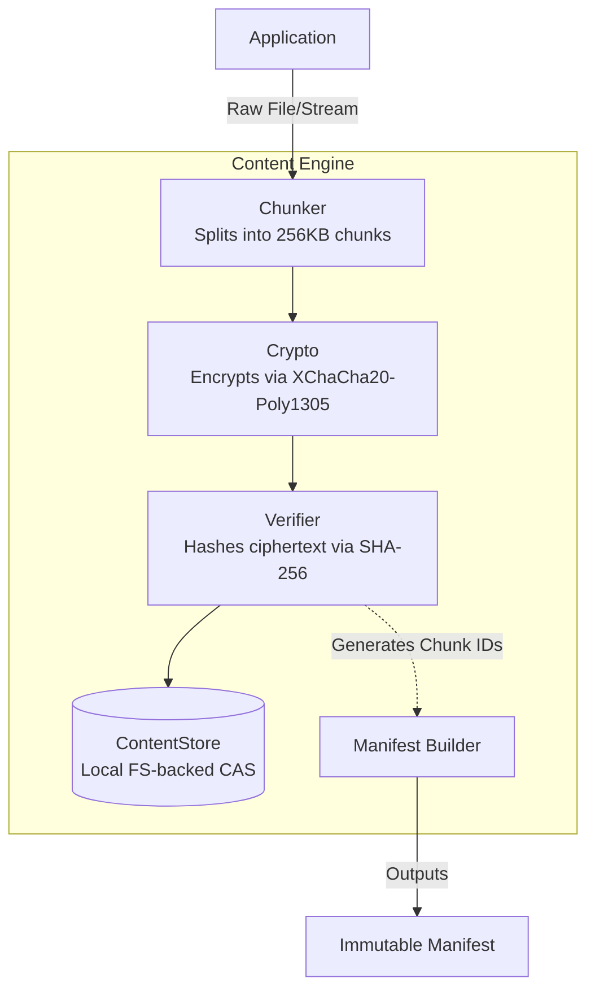
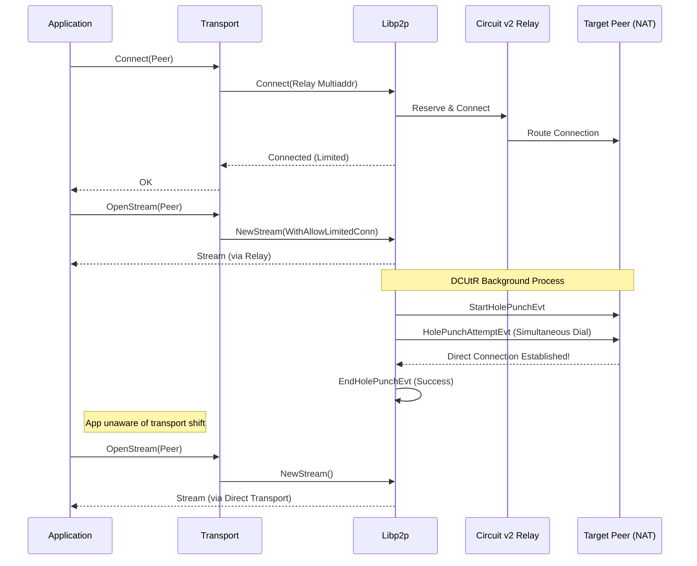
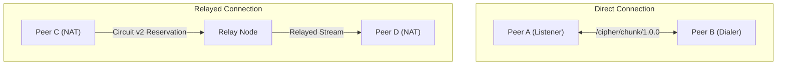

# CIPHER P2P Architecture

## Overview
The CIPHER project is built on top of [libp2p](https://libp2p.io/), utilizing a modular approach to separate concerns across the transport, identity, cryptography, and protocol layers.

## Modules

### `cmd/` (Entrypoints)
- **peer**: The standard client node participating in the network.
- **relay**: A specialized node designed to relay traffic between peers that may be behind NATs or firewalls.

### `internal/` (Core Logic)
- **transport**: Manages the initialization of libp2p hosts, connection establishment, and multiplexing.
- **identity**: Handles peer ID generation, key management, and cryptographic identities. It includes a persistent identity system that ensures a node's `PeerID` remains constant across restarts by storing an Ed25519 private key in the user's OS-level configuration directory (`~/.config/cipher/`, `Library/Application Support/CIPHER/`, or `AppData/Roaming/CIPHER/`).
- **crypto**: Provides standard cryptographic primitives for the broader application.
- **protocol**: Defines the custom network protocol IDs and handling used by CIPHER, currently including `/cipher/chunk/1.0.0` for direct, content-addressed P2P communication.
- **content**: The Content Engine Foundation. A completely decoupled pipeline that manages data ingestion above the transport layer. It contains:
  - **chunker**: Splits files into variable-sized or fixed-sized chunks based on engine config.
  - **crypto**: Encrypts and decrypts chunks independently using XChaCha20-Poly1305.
  - **verifier**: Hashes and verifies chunk/file integrity using SHA-256.
  - **manifest**: Manages immutable content capabilities (Chunk IDs, Hashes, Descriptors) decoupled from decryption rights.
  - **storage**: Defines `ChunkSource` and `ChunkSink` interfaces. Currently implemented using local, content-addressed files.
  - **engine**: The coordinator that wires the pipeline together (ingest and reassembly).
- **transfer**: High-level orchestrator of network downloads. It currently implements session persistence via `internal/transfer/session`, enabling resilient, resumable downloads without altering the stateless network protocol.

### Content Engine Data Flow

The Content Engine completely decouples the application's data ingestion from the transport layer. It operates as an independent pipeline designed for a future decentralized encrypted CDN.

#### 1. Core Data Structures
- **Chunk & Headers**: Data is explicitly split into `ChunkHeader` and `Data` payload. This ensures headers (containing metadata like `Version`, `PlainSize`, and `CipherSize`) can be evaluated independently of the encrypted payload during network transmission.
- **Strong Typing**: The engine uses strict `[32]byte` types for `ChunkID` and `ContentID` to avoid string-encoding bugs, maximize comparison speed, and reduce heap allocations.

#### 2. Cryptography & Verification
- **Chunk Encryption (XChaCha20-Poly1305)**: Every chunk is encrypted independently. The engine generates secure 192-bit (24-byte) nonces automatically. Because chunks are encrypted independently, the engine natively supports out-of-order decryption and random access required by swarming protocols.
- **Content-Addressing**: Chunks are identified strictly by the SHA-256 hash of their **ciphertext**. 

#### 3. Content-Addressed Storage (CAS)
- **Decoupled Sinks**: The storage layer is abstracted behind `ChunkSource` and `ChunkSink` interfaces, ensuring the engine never touches the filesystem directly.
- **Sharded Local Storage**: The current `FSStore` implementation shards chunks using their hex-encoded hash prefixes (e.g., `store/ab/cd/abcdef123...`). This architecture mimics Git/IPFS to prevent filesystem degradation and inode limits when millions of chunks are persisted.

#### 4. Immutable Manifests
The `manifest` module generates a cryptographic capability file after ingestion. It intentionally decouples the **content description** (the ordered `ChunkIDs` and tree root) from the **decryption rights** (the content key). This permits the system to distribute the manifest publicly for swarming while restricting the decryption key to authorized users.

#### 5. Local Session Management & Resiliency
Instead of requiring servers to maintain download states, CIPHER utilizes a strictly **client-side session architecture** for resume and recovery. The `SessionManager` tracks progress using a boolean bitset and persists it locally (e.g., `sessions/<ContentID>.json`). Upon restart, the client skips chunks that are locally present and executes an exponential backoff retry policy for missing chunks. The underlying `/cipher/chunk/1.0.0` protocol remains fully stateless.

## Network Topology
The network utilizes a hybrid peer-to-peer topology where standard peers connect to one another directly if possible, or fallback to utilizing `relay` nodes for NAT traversal and connectivity routing.

### Transport Abstraction
To ensure that the application logic remains decoupled from the underlying transport state, CIPHER implements a `Transport` abstraction layer (`internal/transport/stream.go`). The application simply calls `Transport.Connect()` and `Transport.OpenStream()`. The Transport layer delegates the connection selection to libp2p, which autonomously manages background transport upgrades (e.g., Hole Punching) and provides the application with the best available path.

### Relay Connectivity & DCUtR Hole Punching (Circuit v2)
CIPHER leverages go-libp2p's `circuitv2` protocol for initial relaying and NAT traversal coordination. By default, `circuitv2` establishes **limited** (transient) connections.

While the application can fall back to communicating over these limited relay connections using `network.WithAllowLimitedConn`, CIPHER employs **DCUtR (Direct Connection Upgrade through Relay)**. DCUtR opportunistically runs in the background upon the establishment of a relay circuit. It coordinates a UDP/TCP hole punch, and upon success, automatically establishes a direct connection. Subsequent application streams naturally prefer this direct, high-throughput path over the temporary relay circuit.

#### Hole Punching State Machine
The sequence below illustrates how an application immediately connects via a relay, whilst DCUtR transparently upgrades the transport layer in the background.

