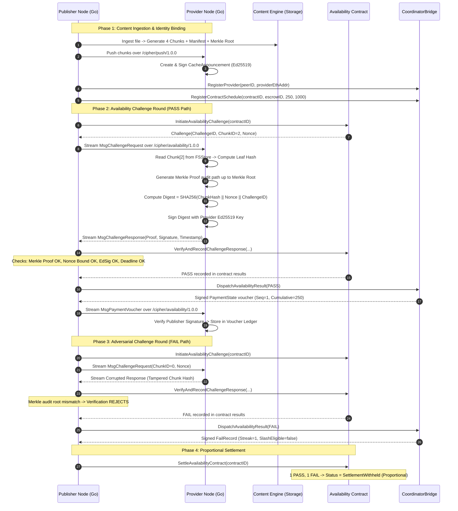

# CIPHER Technical Specification: Availability Subsystem Integration

| Attribute | Value |
| :--- | :--- |
| **Document Title** | Availability, Networking, Storage & Escrow Integration Specification |
| **Status** | Implemented & Verified |
| **Target Subsystems** | `integration/availability`, `availability/`, `network/content`, `network/identity`, `nodes/provider`, `nodes/publisher` |
| **Standards & Protocols** | Libp2p `/cipher/availability/1.0.0`, Binary SHA-256 Merkle Proofs, Hashcash PoW, Dual Identity (Ed25519 + Secp256k1) |
| **Branch** | `feat/network-payments-availability-integration` |

---

## 1. Executive Summary & Objective

The Availability subsystem ensures that storage providers continuously store, maintain, and can rapidly serve assigned content chunks without colluding or silently discarding data. When an availability challenge is issued, the provider must cryptographically prove possession of an exact chunk leaf committed to the file's Merkle root, bound fresh to a challenger-issued nonce, and signed with the provider's authenticated transport key.

This specification details the end-to-end integration between:
1. **The Content & Storage Engine (`network/content/`)**: Resolving chunk manifests and retrieving stored chunks from `FSStorage`.
2. **The Availability Verification Engine (`availability/availability-contracts/`)**: Epoch-based challenge selection, Merkle audit proof verification, and contract lifecycle state management.
3. **The Escrow & Payment Coordinator (`availability/escrow-payment/`)**: Dual-identity binding (`peerID` $\leftrightarrow$ `providerEthAddr`), optimistic off-chain cumulative payment voucher issuance (`PaymentState`), and dispute/slashing evidence collection (`FailRecord`).
4. **The Proof-of-Request Subsystem (`availability/proof-of-request/`)**: Signed provider cache announcements, multi-provider replica tracking ($R \ge 2$), and anti-spam Proof-of-Work (Hashcash) request validation.
5. **The P2P Wire Plane (`/cipher/availability/1.0.0`)**: Libp2p stream protocol exchanging live challenges, cryptographic possession proofs, and off-chain payment vouchers between publishers and providers.

---

## 2. Multi-Plane Architecture

```text
┌─────────────────────────────────────────────────────────────────────────────────────────┐
│                                 CONTROL & STORAGE PLANE                                 │
│                                                                                         │
│   Publisher (nodes/publisher)                               Provider (nodes/provider)   │
│   ┌─────────────────────────────┐                           ┌─────────────────────────┐ │
│   │ Content Engine & Manifest   │                           │ FSStore CAS & Chunks    │ │
│   │ (storage.FSStore)           │                           │ (storage.FSStore)       │ │
│   └──────────────┬──────────────┘                           └────────────┬────────────┘ │
│                  │                                                       │              │
│                  ▼                                                       ▼              │
│   ┌─────────────────────────────┐                           ┌─────────────────────────┐ │
│   │ StorageChunkCountResolver   │                           │ ProviderProofEngine     │ │
│   │ (contract.ChunkCountResolver│                           │ (Merkle Proof Generator)│ │
│   └──────────────┬──────────────┘                           └────────────┬────────────┘ │
└──────────────────┼───────────────────────────────────────────────────────┼──────────────┘
                   │                                                       │
                   │           LIBP2P WIRE PROTOCOL (/cipher/availability/1.0.0)
                   ├───────────────────────────────────────────────────────┤
                   │  1. MsgChallengeRequest (ContractID, ChunkID, Nonce)  │
                   │ ────────────────────────────────────────────────────> │
                   │                                                       │
                   │  2. MsgChallengeResponse (ChunkHash, Proof, EdSig)    │
                   │ <──────────────────────────────────────────────────── │
                   │                                                       │
                   │  3. MsgPaymentVoucher (Signed PaymentState)           │
                   │ ────────────────────────────────────────────────────> │
                   ▼                                                       ▼
┌─────────────────────────────────────────────────────────────────────────────────────────┐
│                              ECONOMIC & ESCROW SETTLEMENT                               │
│                                                                                         │
│   Publisher Coordinator Bridge                              Provider Voucher Ledger     │
│   ┌─────────────────────────────┐                           ┌─────────────────────────┐ │
│   │ CoordinatorBridge           │                           │ AvailabilityStream-     │ │
│   │ - Binds PeerID <-> EthAddr  │                           │   Handler               │ │
│   │ - Dispatches PASS -> Voucher│                           │ - Validates Signature   │ │
│   │ - Dispatches FAIL -> Streak │                           │ - Accumulates Vouchers  │ │
│   └──────────────┬──────────────┘                           └─────────────────────────┘ │
│                  ▼                                                                      │
│   On-Chain Escrow / Settlement (EscrowContract.sol / PaymentChannel.sol)                │
└─────────────────────────────────────────────────────────────────────────────────────────┘
```

---

## 3. Protocol Interaction Sequence



---

## 4. Key Integration Components Delivered

### 4.1 Storage Chunk Count Resolver (`integration/availability/resolver.go`)
Fulfills `availability-contracts/contract.ChunkCountResolver`:
* Decodes hex-encoded `core.ContentID` or string file IDs.
* Queries `core.ManifestStore` / `storage.FSStorage` to fetch serialized manifests.
* Dynamically parses manifests and returns total chunk count (`len(m.ChunkIDs)`).
* `InstallStorageResolver(store)` installs the adapter globally before challenges are issued.

### 4.2 Merkle Tree & Audit Proof Generator (`integration/availability/merkle.go`)
* Binary SHA-256 Merkle tree implementation matching `verification.VerifyMerkleProof`.
* At each level, handles even/odd pairing with symmetric node padding.
* Produces sibling audit path `[][]byte` that directly evaluates:
  $$\text{current} = \begin{cases} \text{SHA256}(\text{current} \parallel \text{sibling}) & \text{if } \text{idx is even} \\ \text{SHA256}(\text{sibling} \parallel \text{current}) & \text{if } \text{idx is odd} \end{cases}$$
* Verified across arbitrary leaf counts (1, 2, 3, 4, 5, 7, 8, 16, 17, 32).

### 4.3 Provider Proof Engine (`integration/availability/proof_engine.go`)
* Manages provider chunk possession proofs.
* When given an issued `availabilitytypes.Challenge`:
  1. Retrieves local chunk data from storage.
  2. Generates Merkle audit proof path to the file root.
  3. Computes replay-protected binding digest:
     $$\text{Digest} = \text{SHA256}(\text{ChunkHash} \parallel \text{Nonce} \parallel \text{ChallengeID})$$
  4. Signs digest with provider's private transport key (`ed25519.PrivateKey`).
  5. Packages into `verification.ChallengeResponse`.
* Supports `HandleChallengeAdversarial` for simulating corrupt hashes or forged signatures.

### 4.4 Dual Identity & Coordinator Bridge (`integration/availability/coordinator_bridge.go`)
* Integrates `network/identity` Dual Identity with `availability/escrow-payment/coordinator`:
  * Maps `peer.ID` $\leftrightarrow$ `bindings.EthereumAddress`.
  * Maps `ContractID` $\leftrightarrow$ `bindings.EscrowContractID`.
* Dispatches verified `availabilitytypes.AvailabilityResult` to `AvailabilityPaymentDispatcher`:
  * **PASS**: Advances sequence, increases cumulative payment, signs `payment.PaymentState` voucher, resets failure streak.
  * **FAIL**: Advances sequence, signs `coordinator.FailRecord`, increments consecutive failure streak, and flags `SlashEligible` if streak $\ge K$ ($K=3$).

### 4.5 P2P Wire Protocol (`integration/availability/protocol.go`)
* Registered on libp2p protocol identifier: `/cipher/availability/1.0.0`
* Framing: 4-byte length prefix (LittleEndian) + 1-byte message type + deterministic JSON payload.
* Message Codes:
  * `0x20`: `MsgChallengeRequest` (Challenge parameters)
  * `0x21`: `MsgChallengeResponse` (Possession proof)
  * `0x22`: `MsgPaymentVoucher` (Signed `PaymentState`)
  * `0x23`: `MsgChallengeError` (Protocol errors)
* `AvailabilityStreamHandler`: Server handler on Provider node.
* `AvailabilityClient`: Client interface on Publisher node.

### 4.6 Demand & Proof-of-Request Bridge (`integration/availability/demand_bridge.go`)
* Bridges `network/content/manifest` to `availability/proof-of-request`:
  * Generates and validates signed `model.CacheAnnouncement`.
  * Tracks multi-node replica availability in `replica.Tracker`.
  * Validates Hashcash Proof-of-Work (`security.VerifyPoW`) on consumer requests before recording in `demand.Tracker`.

---

## 5. Verification & Testing Matrix

| Test Suite | Package | Scope | Result |
| :--- | :--- | :--- | :--- |
| `TestStorageChunkCountResolver` | `integration/availability` | `FSStorage` & dynamic manifest chunk resolution | **PASS** |
| `TestMerkleTree_VerifyProofs` | `integration/availability` | Binary Merkle tree proof validity & adversarial detection | **PASS** (10 leaf counts) |
| `TestProviderProofEngine_HappyPathAndAdversarial` | `integration/availability` | Provider proof generation & contract `VerifyAndRecord` | **PASS** |
| `TestCoordinatorBridge_DispatchPassAndFail` | `integration/availability` | Off-chain vouchers & $K=3$ consecutive failure slashing | **PASS** |
| `TestDemandAndReplicaManager` | `integration/availability` | Signed cache announcements & PoW request tracking | **PASS** |
| `TestAvailabilityProtocol_P2PStreamFlow` | `integration/availability` | Libp2p mocknet challenge and voucher streaming | **PASS** |
| `TestEndToEnd_AvailabilityIntegration` | `integration/availability` | Full 10-step lifecycle (Ingestion $\to$ P2P Proof $\to$ Settlement) | **PASS** |
| `test_workflow.sh` | Full Master Pipeline | 46 Foundry tests + Go Crypto + Wire tests + Live Anvil EVM | **PASS** |
